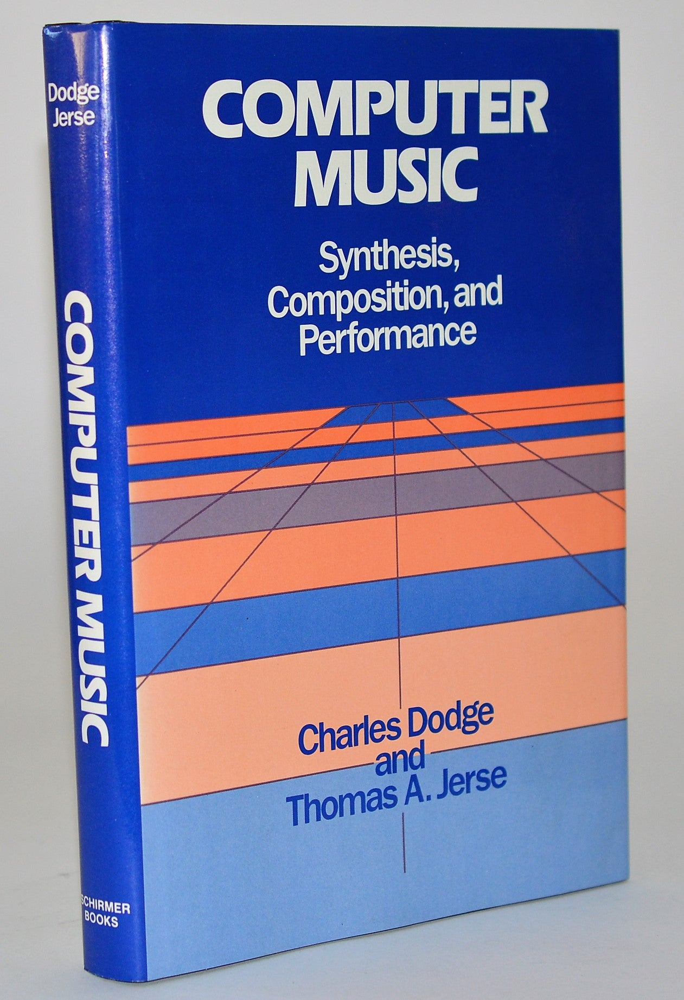
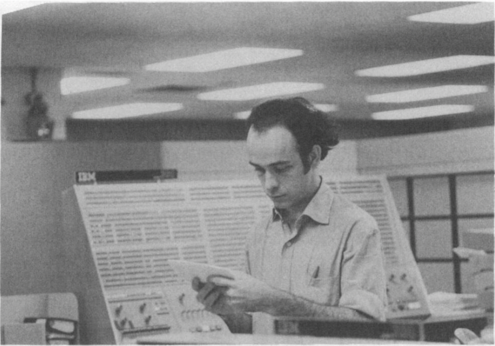
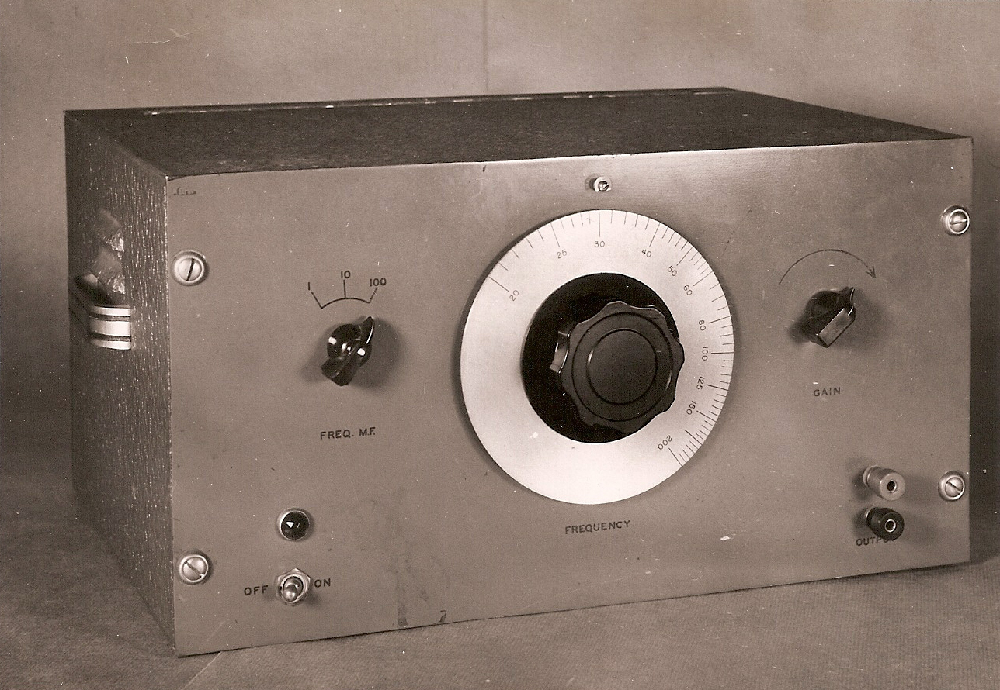
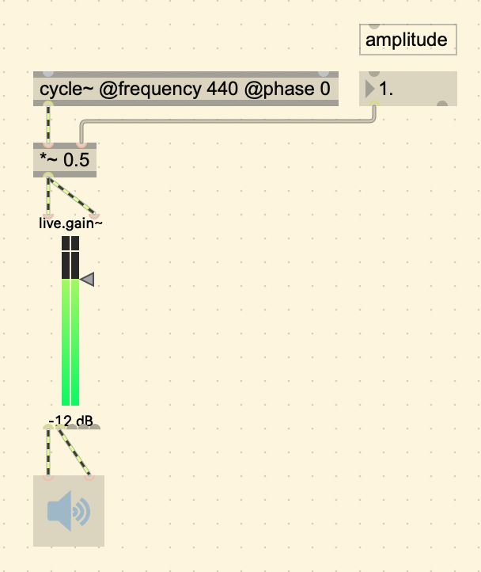

## Introduction

This post is about exploring some fundamental concepts in Digital Signal Processing (DSP) and Digital Sound Synthesis by using a program called Max, a visual programming language.

### Computer Music Book



One of the authors of *Computer Music*, Charles Dodge, was active in computer music composition when it became a new field. In the 1960s, he was at Columbia working on an IBM mainframe computer for his early work, but had to go to Bell Labs to use a digital-to-analog conversion system in order to hear it.[^1]


<div style="text-align: center; padding-bottom: 1em;"><i style="color: #ccd3d5;">IBM 360/91 console and 2250 display</i></div>

In 1970, he worked with three physicists to compose *Earth's Magnetic Field*, where he mapped sounds to magnetic field data. He also worked on synthesizing the human voice with *Speech Songs (1974)*. Another notable work is *Any Resemblance is Purely Coincidental (1980)* which combined live piano performance with a digital manipulation of a recording.



<div style="text-align: center; padding-bottom: 1em;"><i style="color: #ccd3d5;">Dodge at the Columbia University Computer Center in 1970 while he was working on Earth's Magnetic Field.</i></div>

It is important to keep in mind that *Computer Music* was first published in 1985. Dodge demonstrates some code examples using the programming languages *Csound* and *Cmusic*. Despite the incredible difference between the computing power when this was written and now, it still serves as a good introduction to digital signal processing. The ideas are the same, the only difference is that it is now faster and easier with computers today. I will be covering:

- Chapter 4: Synthesis Fundamentals

### Max/MSP

Coincidentally also in 1985, *Max* started to get developed by Miller Puckette. It wasn't until 1989 when it started to use a dedicated DSP board. In 1997, Max saw its first release by the company [Cycling '74](https://cycling74.com/) to include Max/MSP, MSP seeming to stand for "Max Signal Processing" or Miller Smith Puckette's initials. It made Max capable of manipulating real-time digital audio signals without a dedicated DSP board, which made it possible to synthesize sound using a general purpose computer.

The name Max, by the way, is named after [Max Mathews](https://en.wikipedia.org/wiki/Max_Mathews), another pioneer in computer music.

### gen~

`gen~` is an extension of the *Max* patching environment that is more efficient and lower level. It is great because it runs at the signal rate (audio rate), instead of using signal vectors (chunks of samples at a time). This is ideal for designing audio effects because we can work from a sample by sample basis. I will be using this environment to go over concepts that are covered in *Computer Music*.

I won't go over too much about how `gen~` works here, instead there is this [online tutorial](https://cycling74.com/tutorials/gen~-for-beginners-part-1-a-place-to-start) written by Gregory Taylor, author of [Generating Sound & Organizing Time](https://cycling74.com/books/go).

## Synthesis Fundamentals

### Unit Generator

The chapter starts by introducing the concept of a Unit Generator, or UGen for short, which is essentially an algorithm for audio. The Unit Generator theory was first developed by Max Mathews and his colleagues at Bell Labs, originally for the *Music N* programming languages. He describes them in his 1960 article in the Bell Telephone System Technical Journal: 

> "The instruments are formed by combining a set of basic building blocks called *unit generators*, appropriate combinations of which can produce sounds of almost any desired complexity or simplicity." [^2]

### parameters

A UGen might have *parameters*, that make it possible to specify the values of certain variables that change the produced audio. Parameters are inputs, that can either be **entered in** by a user manually, or **received** by another UGen. 

For example, one of the most obvious UGens to start with is an oscillator, one that produces a simple sine tone. Possible parameters for this are:

* Frequency (In Hz)
* Phase
* Amplitude

This is similar to analog synthesis, where an oscillator module with a sine wave generator will usually have a knob for frequency and amplitude (or gain).



<div style="text-align: center; padding-bottom: 1em;"><i style="color: #ccd3d5;">200A Audio Oscillator Production model for 1939</i></div>


Another programming language for sound synthesis that is still used today, *SuperCollider*, carries on the legacy of UGens. The line of code to produce a sine tone is this:

```C++
// A UGen that generates a sine wave.
SinOsc.ar(440, 0, 0.5);
```

This is the breakdown:

* `SinOsc` is the name of the [class](https://en.wikipedia.org/wiki/Class_(computer_programming)).
* `.ar` specifies that it will output at the audio rate.
* `(440, 0, 0.5)` are the parameters. It will have a frequency of 440 Hz, phase of 0, and amplitude of 0.5.

In Max MSP, the term UGen is not used. Instead, they are called objects, but underneath the surface of objects is essentially the same as UGens, they have pre-defined instructions for the computer (algorithms) to generate or process audio. The objects that are for audio have a tilde (`~`). The tilde representing a signal, means that it is calculating at the audio rate, just like in SuperCollider where `.ar` is used. So if the audio rate is set to 44,100, that means that it is calculating 44,100 values per second.



<div style="text-align: center; padding-bottom: 1em;"><i style="color: #ccd3d5;">A simple sine tone</i></div>

<div id="rnbo-root">
<button id="toggle-sound">Toggle</button>
<div id="rnbo-parameter-sliders">
</div>

<script type="text/javascript" src="https://cdn.cycling74.com/rnbo/latest/rnbo.min.js"></script>
<script type="text/javascript" src="js/app.js"></script>
</div>

### Wave Tables

One thing that is the same for all these programs to generate a sine tone, regardless of old or new, is that they are using a `wave table`. This is because this is the most efficient way of doing it. Instead of creating a program that would calculate each following value, it is much easier on the CPU to look up pre-stored values that are in the computer's memory. A wave table is like an audio recording, where the program "plays" or goes through each sample, retrieves it, and restarts from the beginning when it reaches the end. The frequency of the sine tone changes depending on how fast or slow you "play" through the sample.


[^1]: An interview with Charles Dodge (1993). <a href="https://www.jstor.org/stable/3681298">https://www.jstor.org/stable/3681298</a>
[^2]: Max Mathews, An Acoustical Compiler for Musical and Psychological Stimuli, Bell Telephone System Technical Journal, 1961. <a href="https://ia801601.us.archive.org/32/items/bstj40-3-677">https://archive.org/details/bstj40-3-677</a>
