

## Introduction

The Center for Concrete and Abstract Machines (<a target="\_blank" href="https://ccam.world/">CCAM</a>) has invited me to be on their Synthesis Team for the audio software development of three DIY synths that will be showcased in a workshop called <a target="\_blank" href="https://ccam.world/programs/24-5-10-future-rhythm-machines-chicago-house/">FUTURHYTM MACHINES: Chicago House Music</a>. Each synth will have their own name and sonic output:

- "Chronos/Khairos": Drum Sequencer
- "Pocket Calculator": Bass
- "Harmonia Terra": Piano

Each synth circuit uses a custom PCB circuit with potentiometers and buttons for ease of control of parameters. It will also have:

- Stereo audio output/input
- 2 CV outs/ins

</img>

A major goal is for ease of interaction between these synths to create a wonderful sonic experience.

--- 

## Max/MSP gen~ and the Electrosmith Daisy Seed

The heart of this synth is the Electrosmith <a target="\_blank" href="https://electro-smith.com/products/daisy-seed">Daisy Seed</a>. The Kickstarter for this board started in 2020 and has already become a popular choice for audio programmers that want to make their programs come to life by taking a more physical and portable form. This is a perfect board for sound artists wanting to make sound installations, and for performers/musicians wanting to make custom synths for their Eurorack setups. Before this board, the <a target="\_blank" href="https://www.pjrc.com/teensy/">Teensy</a> was a popular choice.

There are several ways to write an audio program to flash into the Daisy, for example you can use Arduino or Pure Data, but I will use the <a target="_blank" href="https://docs.cycling74.com/max8/vignettes/gen_topic">Max/MSP gen~</a> environment, which uses lower-level objects allowing the ability to compile a patch into code that the Daisy can understand. The Max package for flashing the board is called <a target="\_blank" href="https://github.com/electro-smith/oopsy">Oopsy</a>.

For more options and info about how to get started check out this wiki page: <a target="\_blank" href="https://github.com/electro-smith/DaisyWiki/wiki">https://github.com/electro-smith/DaisyWiki/wiki</a>

---

## Generating Sound & Organizing Time

Graham Wakefield and Gregory Taylor's book "Generating Sound and Organizing Time" is a great resource for learning gen~. I will be pulling some useful images from there to demonstrate some of the concepts. I will refer it as the _GO_ book from now on.

</img>

Learn more about it here: <a target="\_blank" href="https://cycling74.com/books/go">https://cycling74.com/books/go</a>

--- 

## The Synth Modules

### Chronos/Khairos

**Description**:

- This synth is a 3-voice drum machine with a bass, snare, and hi-hat.
- Patterns can modulated by randomness. It works with a "topographic" principle (perlin noise).

**Button Control**:

- Bass Drum pattern hits are manually toggled via the 8 available buttons.

**Potentiometer Control**:

- Randomness: 
- Density:

**Audio Synthesis**:

- Bass Drum (kick) sound
- Snare sound
- Hi-hat sound

### Pocket Calculater

Inspired by Erica's Synth Desktop <a target="\_blank" href="https://www.ericasynths.lv/shop/standalone-instruments-1/desktop-bassline-db-01/">Bassline</a>.

Description:

- Shift register for melodic / contour generation
- Euclidean Rhythms

Potentiometer Control:

- 

## Building a Sequencer

The "Hello World" for any sequencer construction is to have a single event triggered repeatedly by a clock.

### Phasor

The way to make a clock in Max gen~ is by using a `[phasor]` object. The number following phasor is the _frequency_ parameter. 

Creating a `[phasor 1]` will create a ramp going at a rate of 1Hz, going from a value of 0.0 to 1.0 in one second.

</img>

<i style="color: #ccd3d5;">The live.scope~ object defaults to plotting 44.1k samples.</i>

</img>

<i style="color: #ccd3d5;">This plot better shows what the X and Y axes represent.</i>

### Trigger (click)

What we want is for this ramp to trigger an event when it resets its cycle. In the analog synthesis world, a _trigger_ is a very short pulse (1-2ms) that is used to activate something, in Max/MSP gen~ a _click_ is the closest equivalent. A click is simply an output of 1.0 for one sample.

</img>

In the _GO_ book, this figure is provided to demonstrate what it should look like, describing the clicks as ticks.

</img>

Conveniently, the _GO_ book comes with an abstraction called `go.ramp2trig` that creates a trigger (click) when the ramp resets.

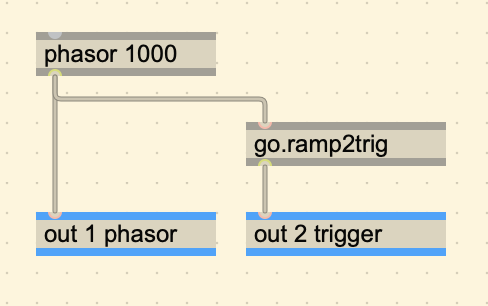</img>

<i style="color: #ccd3d5;">gen~ patch with a 1000Hz phasor.</i>

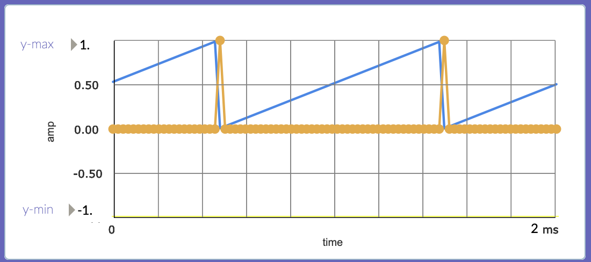</img>

<i style="color: #ccd3d5;">Plot showing the phasor (blue) and the trigger (orange)</i>

<ul uk-accordion>
<li class=" uk-closed">
<a class="uk-accordion-title" href="#">Breakdown: go.ramp2trig</a>

<h3>go.ramp2trig Breakdown</h3>

The get a trigger out of a phasor we have to send a 1 when we detect a big jump/change in value between the current and last sample of the phasor output.

A quick and dirty way of doing this is by using the <code>[delta]</code> operator

<b>[delta]</b>

<blockquote> Returns the difference between the current and previous input.</blockquote>
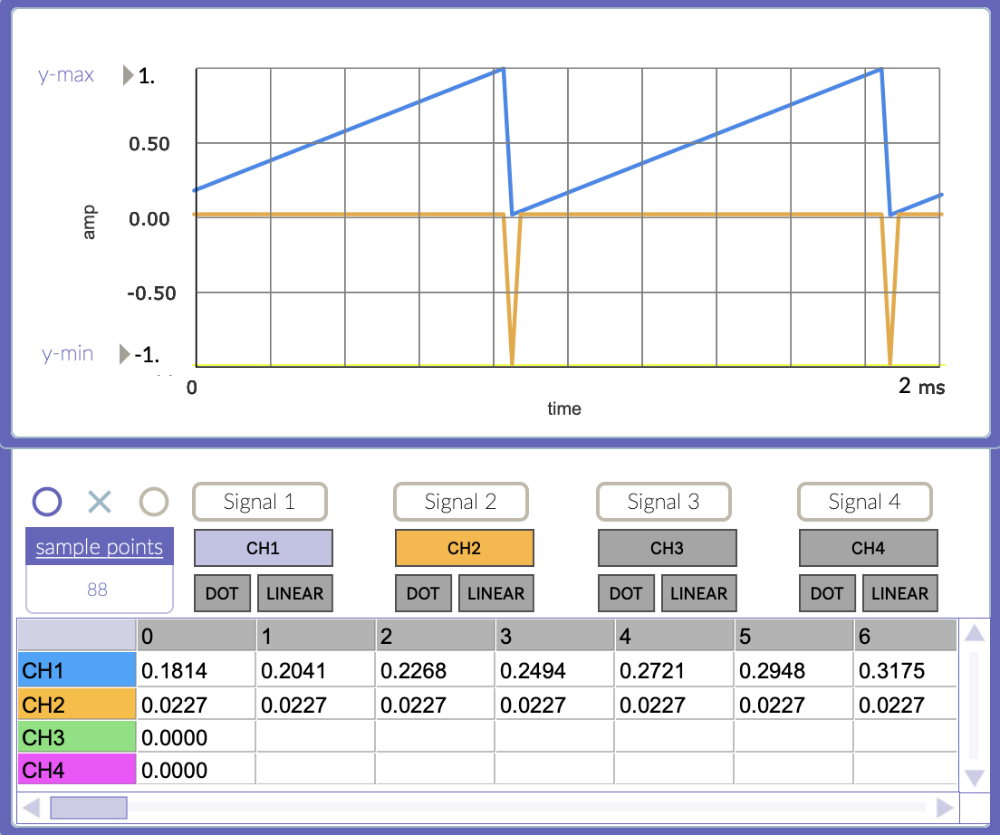</img>

<i style="color: #ccd3d5;">The orange plot shows the output of delta. The corresponding row shows a consistent output of 0.0227 until the phasor resets, giving an output of -0.9773. This makes sense because with an audio rate of 44.1kz and a phasor of 1000Hz, we can get that value 1000/44,1000 = 0.02267.</i>

The difference in change could be incrementing or decrementing, so we should use an <code>abs</code> operator to take both cases into account.

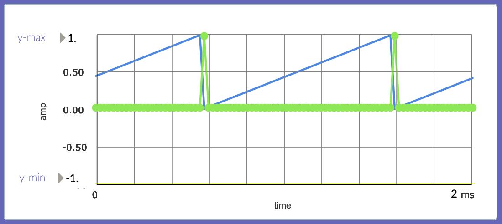</img>

<i style="color: #ccd3d5;">The green plot shows the output of [abs]. Values are the same as before but always positive.</i>

Lastly, we can use <code>[< 0.5]</code> to see if the change is greater than 0.5. If condition is true, it will output a value of 1, which is what we need.

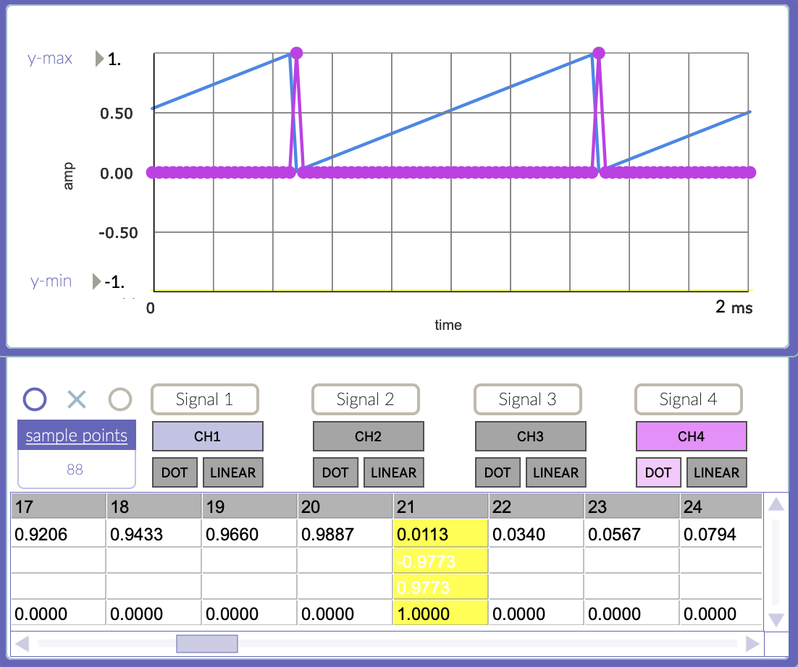</img>

<i style="color: #ccd3d5;">The magenta plot shows the output of [< 0.5], showing an output of 1 when the change is greater than 0.5.</i>

</li>
</ul>

### Event

The next step is to have that trigger activate a sound event. As a simple example we can trigger an envelope on a running oscillator.

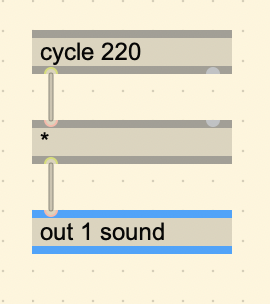</img>

<i style="color: #ccd3d5;">A running oscillator of 220Hz.</i>

We pass the `[cycle]` through a `[*]` operator because the right inlet will be used for the envelope signal. This signal will go from 0.0 to 1.0 in a certain amount of time, starting when it receives a trigger.

A very simple way is by using a combination of `[counter]` and `[%]`.

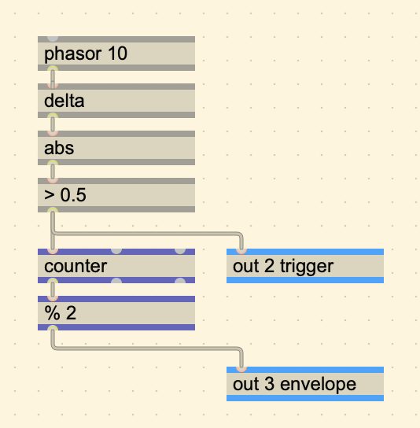</img>

<i style="color: #ccd3d5;">Using [counter] and [%].</i>

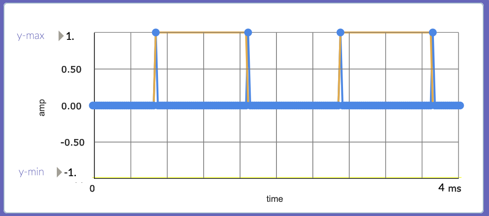</img>

<i style="color: #ccd3d5;">Plot of envelope.</i>

In this case, a trigger is used to repeatedly turn on the envelope, AND turn off.

The `[counter]` operator does exactly what it is called, it counts how many triggers it receives until is is told to reset. In reality, it is adding the value on the left most inlet every sample. Whenever it is 0, it adds 0, and when it is 1, it adds 1.

**[counter]**:

>  Accumulates and outputs a stored count, similarly to Max's counter object, but triggered at sample-rate. The amount to accumulate per sample is set by the first input (incr). The count can be reset by a non-zero value in the second input (reset). The third inlet (max) sets a maximum value; the counter will wrap if it reaches this value. However if the maximum value is set to 0 (the default), the counter will assume no limit and count indefinitely. The first outlet outputs the current count, the second outlet outputs 1 when the count wraps at the maximum and zero otherwise, and the third outlet outputs the number of wraps (the carry count).

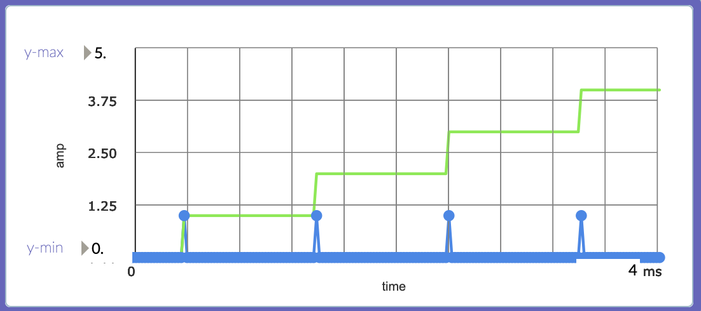</img>

<i style="color: #ccd3d5;">A plot of [counter] with triggers.</i>

We can start to connect the envelope now to hear the result, but there is a problem. The immediate change from 0.0 to 1.0 creates clicks which is not ideal.

<button class="ezdac-button" id="00_ezdac-button"></button>

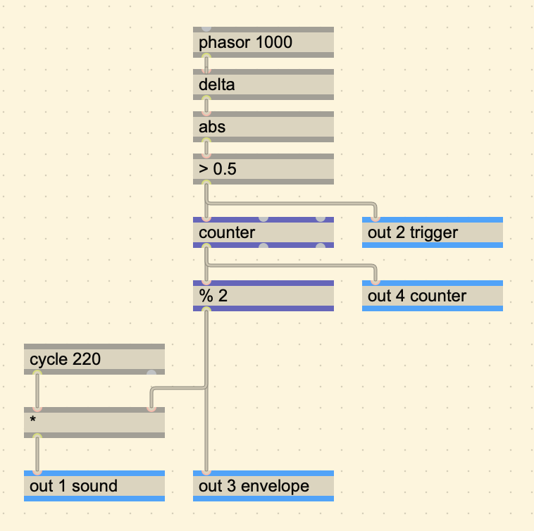</img>

<i style="color: #ccd3d5;">Hooking up the envelope to the oscillator.</i>

A nice way to ease the transition is by using `[slide]`.

<blockquote>Use the slide operator for envelope following and lowpass filtering. Related to the MSP slide~ object.</blockquote>

The `[slide]` operator takes two parameters.

1. Slide up value (in samples)
2. Slide down value (in samples)

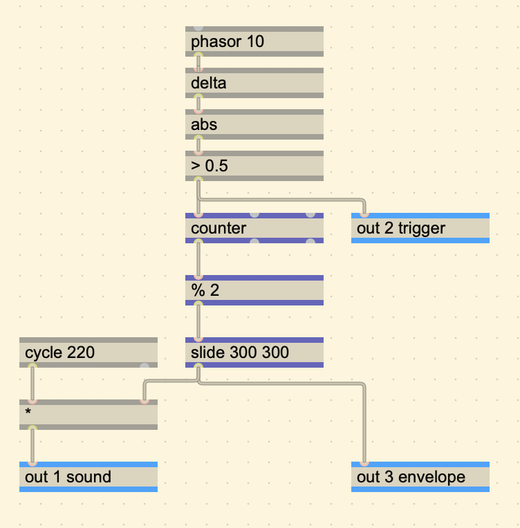</img>

<i style="color: #ccd3d5;">gen~ patch with [slide] added.</i>

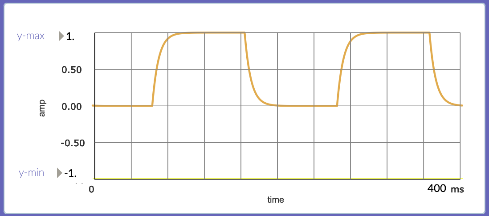</img>

<i style="color: #ccd3d5;">The new shape of the envelope.</i>

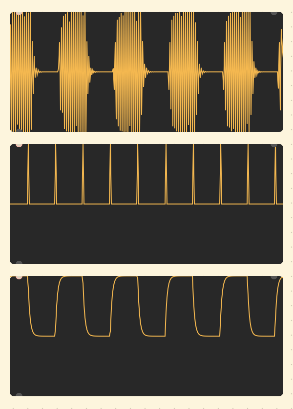</img>

<i style="color: #ccd3d5;">From top to bottom: Sound, Trigger, Envelope</i>

<button class="ezdac-button" id="01_ezdac-button"></button>

The result in a much cleaner sound. This completes the barebones of a sequencer. By adding more sounds triggered at different times we can create interesting additive results.

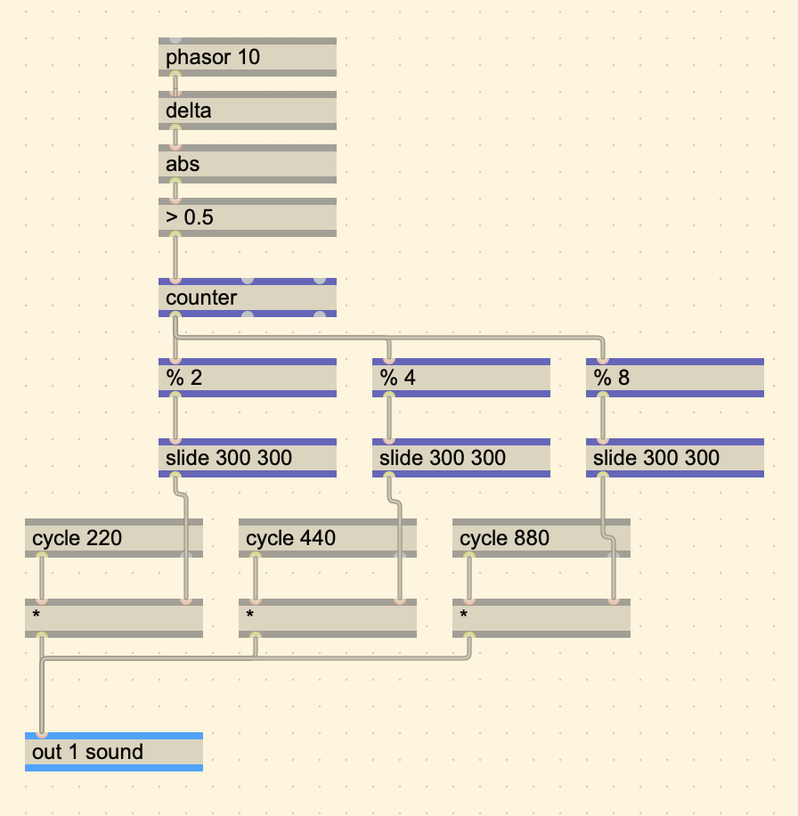</img>

<i style="color: #ccd3d5;">Adding more sounds triggering at different times can lead to interesting results.</i>

<button class="ezdac-button" id="02_ezdac-button"></button>

---

#### go.simple.kick, go.simple.snare, go.simple.hihat

For the sake of getting right to the chase of making a drum sequencer, I will be using the provided `GO` examples that synthesize a snare drum, kick, and hihat. These abstractions take a trigger to activate the sound.

---

### Adding BPM

To add BPM, we can create a `[param]` called BPM, and divide it by 60.

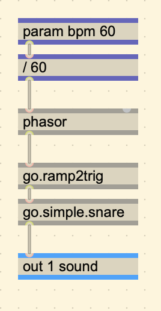</img>

<i style="color: #ccd3d5;">Adding BPM.</i>

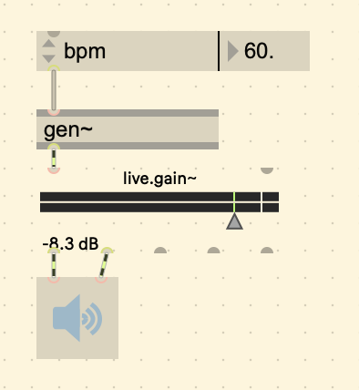</img>

<i style="color: #ccd3d5;">BPM param in the attrui object in Max.</i>

A BPM of 60 will give a frequency of 1Hz, a BPM of 120 will give a frequency of 2Hz, etc.

### Steps and Hits

To create steps from a ramp, we can multiply a ramp by the number of steps we want, and then using the `[floor]` operator.

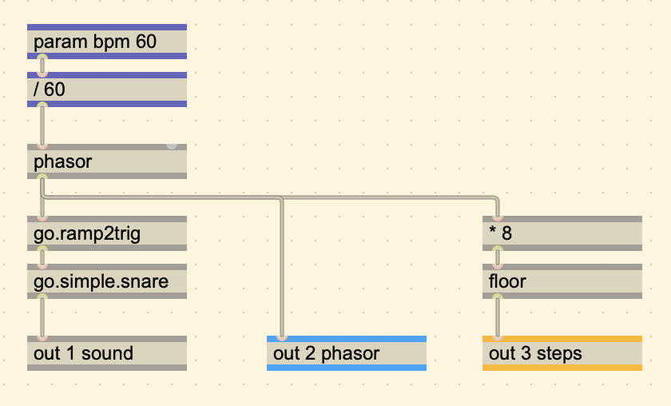</img>

<i style="color: #ccd3d5;">Multiplying the ramp and using [floor] to create steps.</i>

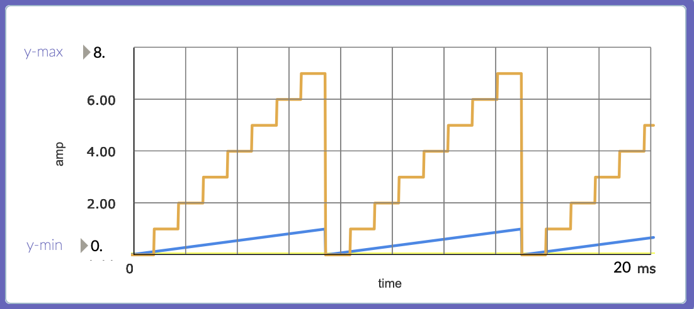</img>

<i style="color: #ccd3d5;">Plot of the stepped output.</i>

Here is the plot with the multiplied phasor:

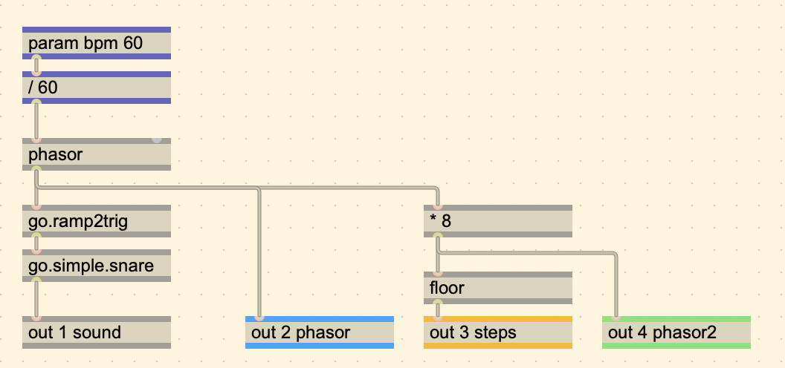</img>

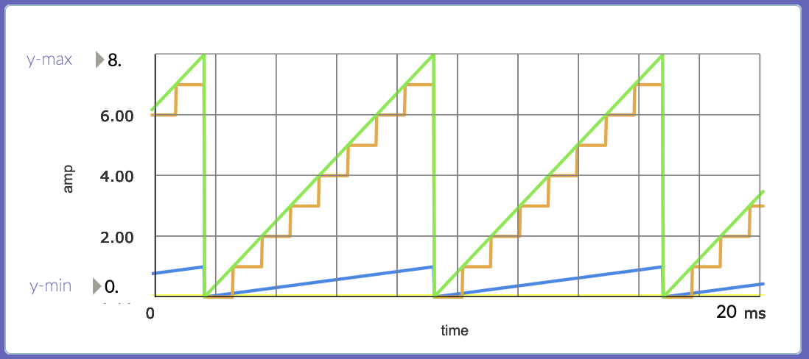</img>

<i style="color: #ccd3d5;">Plot including the multiplied phasor and stepped output.</i>

Note that the count of the orange plot starts at 0 and goes up to 7. To quantize them to be between 0 and 1, we can just divide by 8 again.

</img>

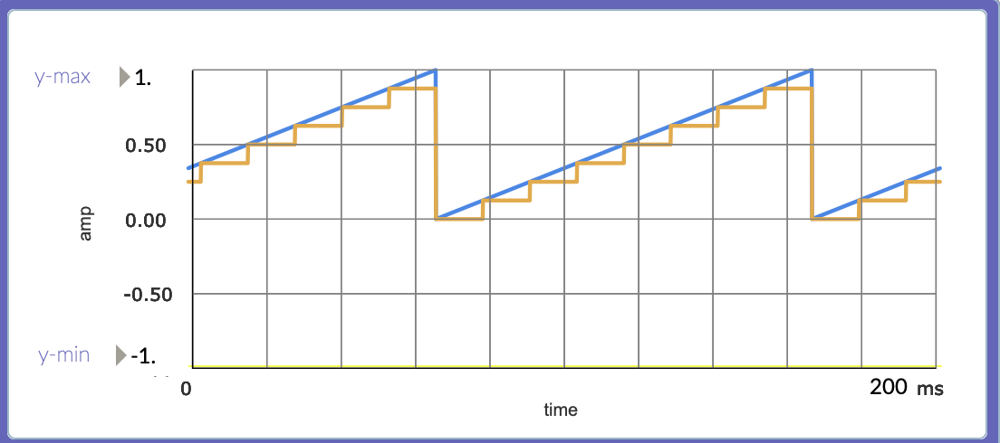</img>

<i style="color: #ccd3d5;">Quantizing the ramp and steps to be between 0.0 and 1.0.</i>

---

### Creating a Topographic Map

This module is a topographic drum sequencer, meaning that it derives its drum sequences based on a map.

