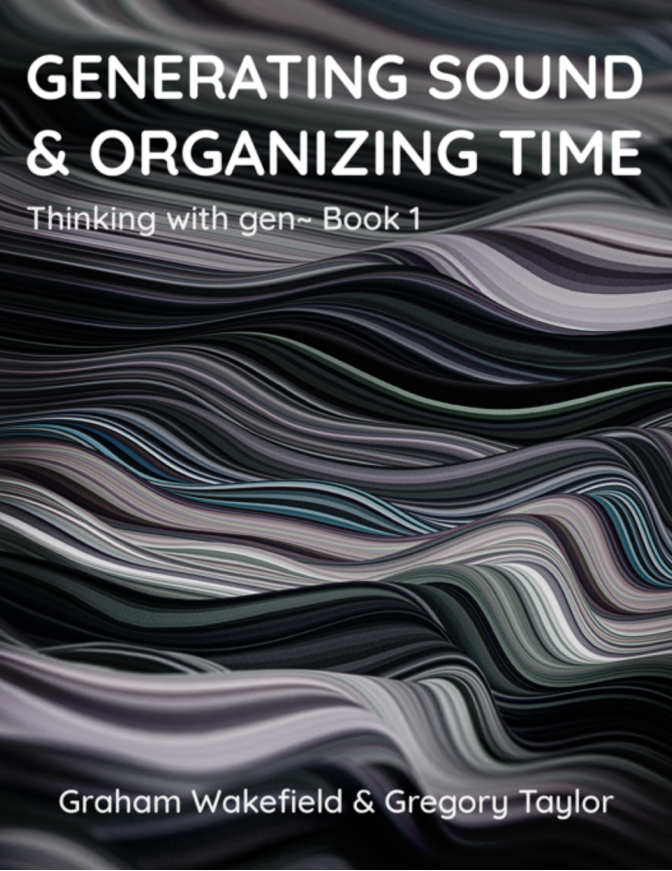
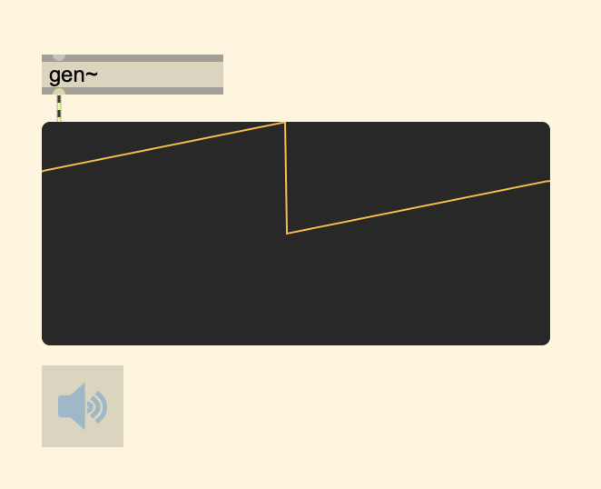
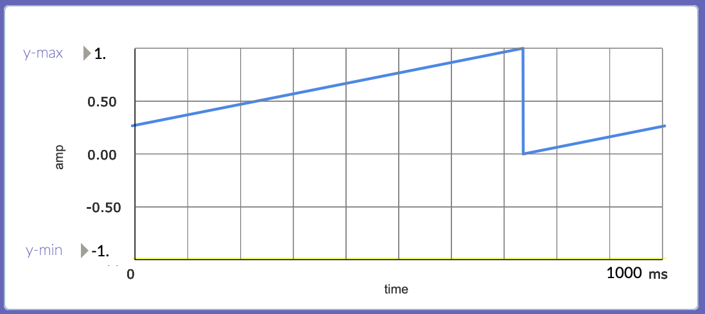
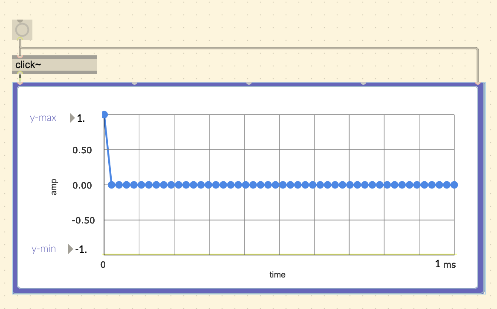
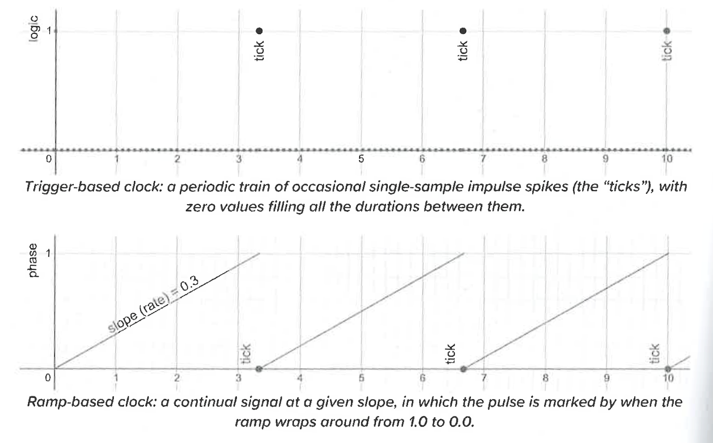

## Introduction

The Center for Concrete and Abstract Machines (<a target="\_blank" href="https://ccam.world/">CCAM</a>) has invited me to be on their Synthesis Team for the audio software development of three DIY synths that will be showcased in a workshop called <a target="\_blank" href="https://ccam.world/programs/24-5-10-future-rhythm-machines-chicago-house/">FUTURHYTM MACHINES: Chicago House Music</a>. Each synth will have their own name and sonic output:

- "Chronos/Khairos": Drum Sequencer
- "Pocket Calculated": Bass
- "Harmonia Terra": Lead Synth

Each synth circuit uses a custom PCB circuit with potentiometers and buttons for ease of control of parameters. It will also have:

- Stereo audio output/input
- 2 CV outs/ins

</img>

A major goal is for ease of interaction between these synths to create a wonderful sonic experience.

--- 

## Max/MSP gen~ and the Electrosmith Daisy Seed

The heart of this synth is the Electrosmith <a target="\_blank" href="https://electro-smith.com/products/daisy-seed">Daisy Seed</a>. The Kickstarter for this board started in 2020 and has already become a popular choice for audio programmers that want to make their programs come to life by taking a more physical and portable form. This is a perfect board for sound artists wanting to make sound installations, and for performers/musicians wanting to make custom synths for their Eurorack setups. Before this board, the <a target="\_blank" href="https://www.pjrc.com/teensy/">Teensy</a> was a popular choice.

There are several ways to write an audio program to flash into the Daisy, for example you can use Arduino or Pure Data, but I will use the <a target="_blank" href="https://docs.cycling74.com/max8/vignettes/gen_topic">Max/MSP gen~</a> environment, which uses lower-level objects allowing the ability to compile a patch into code that the Daisy can understand. The Max package for flashing the board is called <a target="\_blank" href="https://github.com/electro-smith/oopsy">Oopsy</a>.

For more options and info about how to get started check out this wiki page: <a target="\_blank" href="https://github.com/electro-smith/DaisyWiki/wiki">https://github.com/electro-smith/DaisyWiki/wiki</a>

---

## Generating Sound & Organizing Time

Graham Wakefield and Gregory Taylor's book "Generating Sound and Organizing Time" is a great resource for learning gen~. I will be pulling some useful images from there to demonstrate some of the concepts. I will refer it as the _GO_ book from now on.

</img>

Learn more about it here: <a target="\_blank" href="https://cycling74.com/books/go">https://cycling74.com/books/go</a>

--- 

## Chronos/Khairos

**Description**:

- This synth is a 3-voice drum machine with a bass, snare, and hi-hat.
- Patterns can modulated by randomness. It works with a "topographic" principle (perlin noise).

**Button Control**:

- Bass Drum pattern hits are manually toggled via the 8 available buttons.

**Potentiometer Control**:

- Randomness: 
- Density:

**Audio Synthesis**:

- Bass Drum (kick) sound
- Snare sound
- Hi-hat sound

### Building a Sequencer

The "Hello World" for any sequencer construction is to have a single event triggered repeatedly by a clock.

The way to make a clock in Max gen~ is by using a `[phasor]` object. The number following phasor is the _frequency_ parameter. `[phasor 1]` will create a ramp that goes from 0.0 to 1.0 in one second.

</img>

<i style="color: #ccd3d5;">The live.scope~ object defaults to plotting 44.1k samples.</i>

</img>

<i style="color: #ccd3d5;">This plot better shows what the X and Y axes represent.</i>

What we want is for this ramp to trigger an event when it resets its cycle. In the analog synthesis world, a _trigger_ is a very short pulse that is used to activate something, in Max/MSP gen~ a _click_ is the closest equivalent. A click is simply an output of 1.0 for one sample.

</img>

In the _GO_ book, this figure is provided to demonstrate what it should look like, describing the clicks as ticks.

</img>

### Events and Hits
