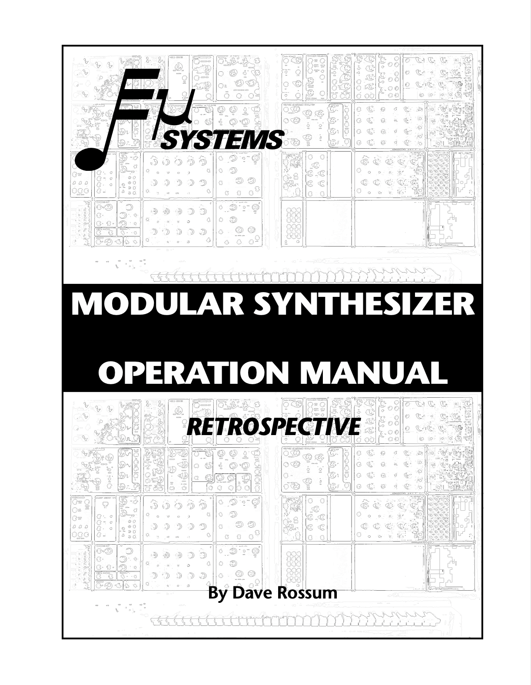
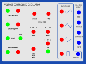

## Introduction

<a target="\_blank" href="https://rnbo.cycling74.com">RNBO</a> was released by Cycling '74 in 2022 as another patching environment specifically for exporting your patches as portable code that can be run as a VST, Max external, web application, and can even be exported to a Raspberry Pi or another similar board for sound. Before this, one of the downsides of Max/MSP was that if you wanted a friend to run your Max patch, they would need a computer that can run the software. With RNBO, it is now easy to take your patches anywhere you please in just about any form you want.

RNBO can also export your patch as C++ code, which is the audio programmer's language of choice for its fast processing. 

This is important for the task that I want to carry out, which is to recreate the <a target="\_blank" href="https://en.wikipedia.org/wiki/E-mu_Modular_System">E-mu Modular System</a> in <a target="\_blank" href="https://vcvrack.com/">VCV Rack</a>.

</img>

---

## The Operation Manual / The Challenge

</img>

To guide me in being faithful to the subtleties of the analog machine, I will be holding Dave Rossum's manual close.

This brings up a problem having to do with the impossible task of recreating an analogue sound in the digital world. While I do intend to get as close as I can to that unique timbre resulting from the audio generators and filters, my main goal is to have the workflow be the same. 

I have found this synth to be an excellent introduction to analog audio synthesis. I find the designs of the modules to be very clear and straightforward. Being able to work with this machine in person was a priviledge and my hope is to give it more reach to other people wanting to learn how it works.

---

## VCV Rack Starter Example

In the Cycling '74 website there is an <a target="\_blank" href="https://rnbo.cycling74.com/explore/vcv-rack-starter">example</a> on how to make a simple VCV Rack module called crunch. However, it doesn't go into detail about how to customize the design of the panel or how to hook up the inputs, outputs, and parameters.

For more information, you would need to go to the VCV plugin <a target="\_blank" href="https://vcvrack.com/manual/PluginDevelopmentTutorial">documentation</a> for developers.

In there, you can find a <a target="\_blank" href="https://vcvrack.com/manual/Panel">panel guide</a> to make sense of this simple example provided by them.

</img>

The panel is just an SVG file. The main special thing to note is the colorful circles used to distinguish the type of component.

From the VCV documentation:

- <i style="color: #0000ff;">BLUE</i> : Output
- <i style="color: #00ff00;">GREEN</i> : Input
- <i style="color: #ff0000;">RED</i> : Parameter
- <i style="color: #ff00ff;">MAGENTA</i> : Light

## Voltage Controlled Oscillator

### Front Panel

</img>
