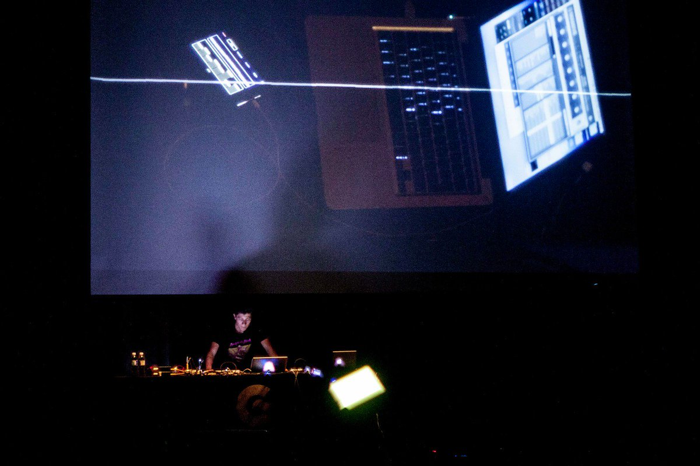

# Residue (2016)
<iframe src="https://player.vimeo.com/video/166680557" width="1920" height="1080" frameborder="0" allowfullscreen uk-responsive uk-video="automute: true"></iframe>

Residue is an installation that integrates paintings with composited video projections to present a liminal space with an intersectional experience of the physical residues that are left behind by fleeting bodies who are crossing the border. The fence represents the in between space one transitions from one place to another.
The inspiration came after being struck by the images of refugees leaving torn and bloody clothes behind on the sharp edges of border fences, while also seeing the moments in other cases where some leave their clothes to dry while camping around them. I attempted to create an ambiguous combination of the two where it becomes a mixture of panic and frantic climbing that resembles those who move with a sense of urgency and danger, and those doing calm and attentive laundry. Like shedding off outer skin, there is a sense of vulnerability in these places where nothing is certain.
Crossing thresholds is part of being human, but it does not always guarantee safe passage. There are the cases of those who get lost in limbo. To present this, two trapped figures in a chain link fence frame are placed in the corners near the entrance to the gallery, and fill the space with the sound of the metal being pushed and pulled as they try to find a way out.

**Location**: Connecticut College

**Materials**: Acrylic Paint w/super imposed video. chain link fence, scrim fabric.

---

# Stations (2016)  
 

Stations.

# Spectrum (2017)  
<iframe src="https://player.vimeo.com/video/228955732" width="1920" height="1080" frameborder="0" allowfullscreen uk-responsive uk-video="automute: true; autoplay: false;"></iframe>

The sound installation/performance is an attempt to use the space to represent the union of chaos and order. The installation changes from being an interactive instrument for the public, to an instrument used for a performance by the artist. It is an improvisation using a mix of sounds from local radio stations, generated sine tones, and white noise that play with the idea of using a receptive sound object that helps us find ways to get lost, disappear, meditate, and find harmony.

**Location**: Espectro Electrónico Sound Artist Residency

**Materials**: 23 Speakers, found bicycle wheel, audio interface with 8 stereo outputs, 4 FM transmitters and receivers, Mac Computer running Max7/MSP.

# Transmitter (2018)  
  

Transmitter is an experimental sound piece that involves two performers in constant communication. One who utilizes multiple LCD monitors and screens to produce sounds and visuals, and the other behind a computer creating soundscapes and imagescapes using Max/MSP, Pure Data and Processing. Through an accelerometer, a gyroscope, and a piezo disc, the piece takes advantage of the use of the performers physical movement to send messages with data on instrument angle, direction, velocity, and vibration.
In their back and forth dialogue, they produce an environment that envelops the space with an anxiety familiar to a screen heavy contemporary culture that pumps out information superfluously.

**Location**: Centro Cultural de España, Mexico City.

**Materials**: Two Mac Computers, Audio Interface w/ 2 Stereo Inputs & 2 Outputs, Wearable Technology called "Screen Goggles" with a pair of 2" Screens. Needs: Projector with HDMI Cable, Speakers with 2 TRS to XLR or 2 TRS to TRS cables. (Our output is TRS), A power extension with at least 5 standard sockets.

**Documentation**:
<iframe width="100%" height="300" scrolling="no" frameborder="no" allow="autoplay" src="https://w.soundcloud.com/player/?url=https%3A//api.soundcloud.com/tracks/322481683&color=%23ff5500&auto_play=false&hide_related=false&show_comments=true&show_user=true&show_reposts=false&show_teaser=true&visual=true"></iframe>
<a href="https://soundcloud.com/juanflores-15" title="JuanFlores" target="_blank" style="color: #cccccc; text-decoration: none;">JuanFlores</a> · <a href="https://soundcloud.com/juanflores-15/mod18perform" title="MOD18 Performance ft. Isaac Medina" target="_blank" style="color: #cccccc; text-decoration: none;">MOD18 Performance ft. Isaac Medina</a>

# Post-Data (2019)  
<iframe src="https://player.vimeo.com/video/372649404" width="1920" height="1080" frameborder="0" allowfullscreen uk-responsive uk-video="automute: true; autoplay: false;"></iframe>

Presented as part of Luminaria Contemporary Arts Festival, Post-Tw.In.Yo.Go.Fa. (Post-Data), is the name of the dystopian digital realm that imagines life after the fall of five internet beasts (Twitter, Instagram, Youtube, Google, and Facebook). By using the hashtag #luminariasa people engaged with the artwork and were able to see their posts altered and disrupted on the screen in real time.

# Toy Instrument Compositions (2020)  
<iframe src="https://www.youtube.com/embed/fc7ng6B_f5s" width="1920" height="1080" frameborder="0" allowfullscreen uk-responsive uk-video="automute: true; autoplay: false;"></iframe>

# These Eyes (2020)  
  
These-Eyes is a live coding performance with an interactive component from the viewers. A website is setup on Heroku to grab an image from https://thispersondoesnotexist.com periodically and scan it for eyes using OpenCV. These eyes are then constructed in a collage and presented on the top of the site and dynamically updated. Optionally, the public can submit their own detected eyes by turning on their webcam. This grid of eyes will be our visual material to be manipulated by us in real time using the live coding environment Hydra (https://github.com/ojack/hydra), while at the same time generating related bodily and electronic sounds using Tidalcycles (https://tidalcycles.org/index.php/Welcome).

**Location**: To be presented virtually as part of the Piksel20 Festival held in Bergen, Norway. November 19-22.

# Debris (2020)  

Debris is a video installation that shows two different kinds of objects. One type is of stereotypical building tools one would expect, and the other is children's toys.

#### Statement
My beginnings in the art world, besides being a wannabee inventor since a child, was in late 2010 when I joined the MOSAIC student artist program provided by the Blue Star Contemporary Art Museum in San Antonio, TX. Being just a short 10 minute walk from my highschool, it was there where I began to get the help and confidence I needed to exhibit my first oil paintings, relief prints, and where I got my first paycheck for working on a large scale collaborative mural project that is still installed in the east side of San Antonio representing historical local buildings. These experiences were to influence my perspective on how art in public spaces can affect and contribute to communities.

It was not until my second year enrolled in Connecticut College, when I became enamored by artwork that involved technology. Up until then, work that involved coding, electronics, robotics, and other types of high-tech tools felt inaccessible for being expensive and requiring professional level training. While I took advantage of the tools available to me as a student fellow of the Ammerman Center for Arts and Technology, I quickly started to build a list of free and open source software and learning how to code. Of these new worlds that were new to me in creative art making, sound became one of the focuses I brought with me to Mexico City, funded by the Mortimer Hays-Brandeis Fellowship in 2016 after graduation. In Mexico I solidified my interests in work that was made by found electronics and accessible creative coding environments.

#### Contact 
email me at: juanedflores@gmail.com
