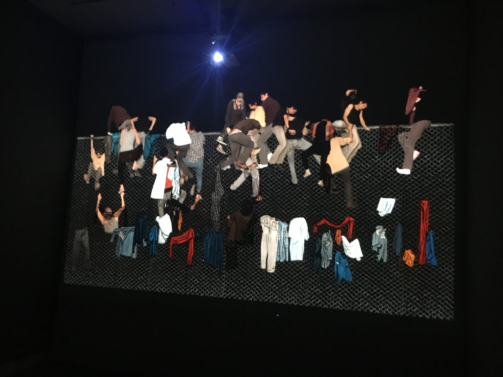
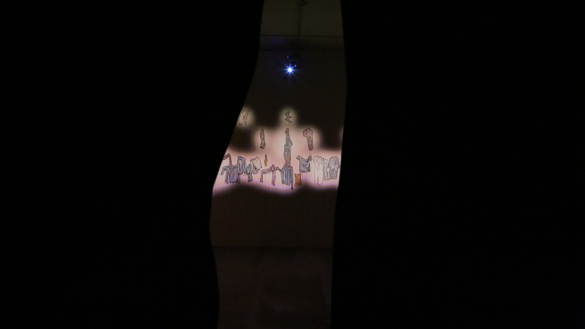
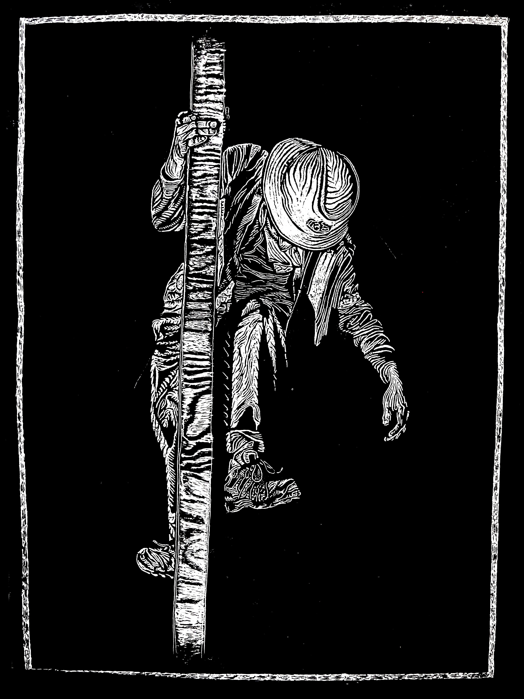
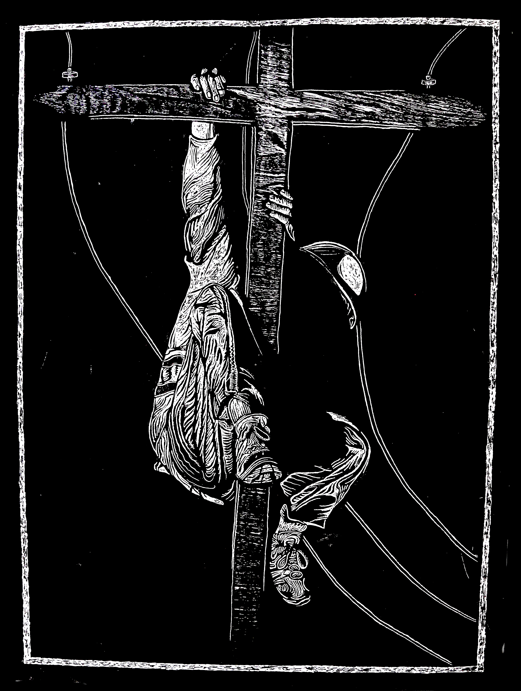
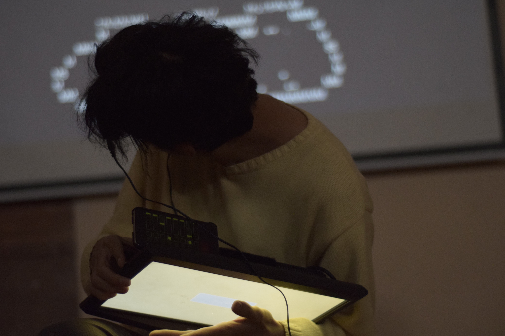
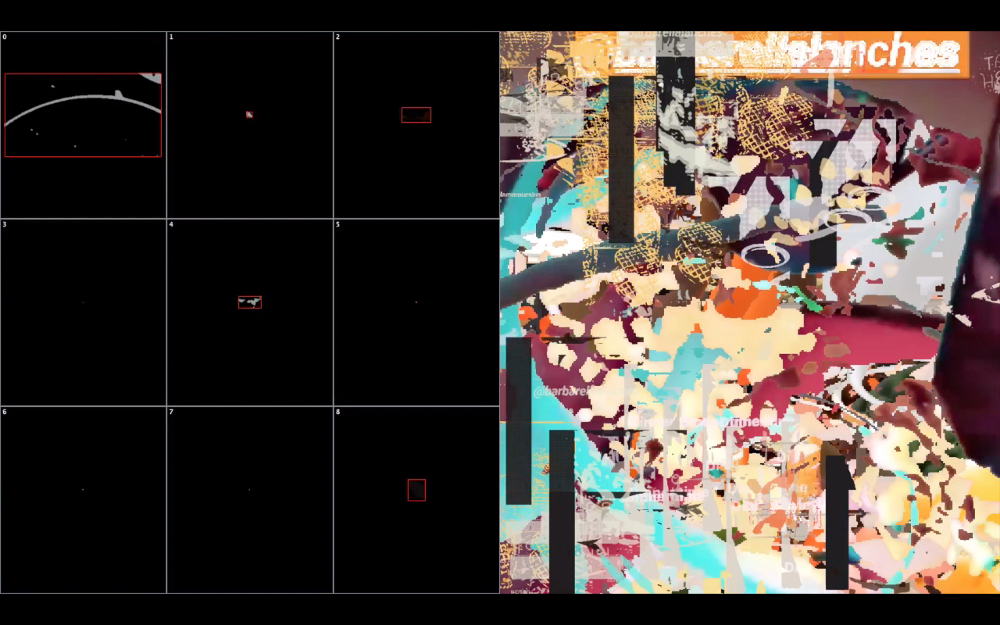
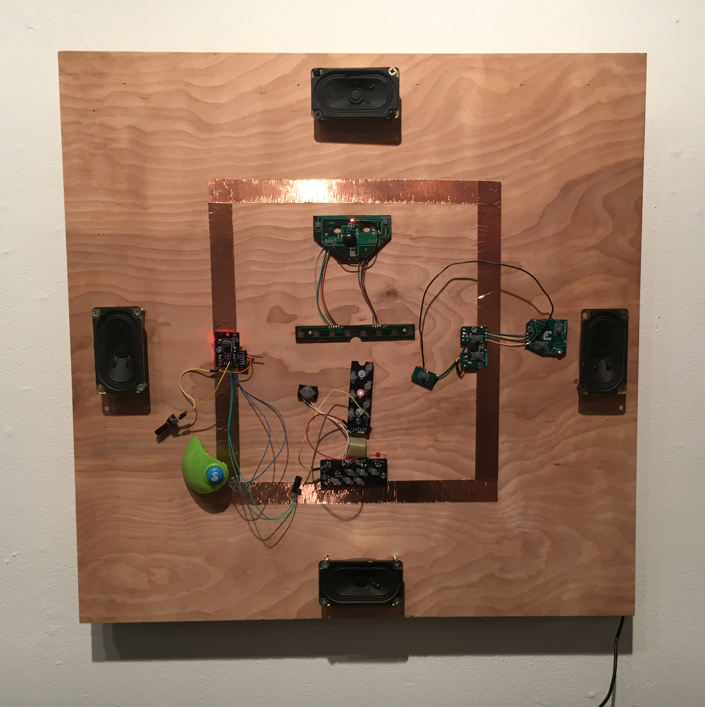

# Residue (2016)   
<iframe src="https://player.vimeo.com/video/166680557" width="1920" height="1080" frameborder="0" allowfullscreen uk-responsive uk-video="automute: true; autoplay: false;"></iframe>

**Residue** is a video installation that deals with the topic of borders, separation barriers, and the in-between spaces.
The main component is a video of people climbing and descending a chain link fence wall. As the number of people passing accumulates, so does the clothing that occasionally gets left behind in the struggle. These pieces of colorful fabric get synced up with a painted mural underneath the projection to create a hybrid image of paint and light. At the end, a spotlight is cued to reveal the painting underneath.
At the opposite end, the viewer is greeted by two life sized projected figures trapped in a frame of the same metallic material. The clinking sounds of their struggle to find an escape fill the gallery space.

---

Site: Connecticut College, White Box Gallery. New London, CT.

Materials: Acrylic Paint with superimposed video, chain link fence, scrim fabric.

```{=html}
<div class="uk-position-relative" uk-slideshow="animation: fade">

    <ul class="uk-slideshow-items">
        <li>
            
        </li>
        <li>
            
        </li>
        <li>
            
        </li>
        <li>
            
        </li>
        <li>
            
        </li>
        <li>
            
        </li>
        <li>
            
        </li>
    </ul>
    
    <div class="uk-position-bottom-center uk-position-small uk-visible@l">
        <ul class="uk-thumbnav">
            <li uk-slideshow-item="0"><a href="#"></a></li>
            <li uk-slideshow-item="1"><a href="#"></a></li>
            <li uk-slideshow-item="2"><a href="#"></a></li>
            <li uk-slideshow-item="3"><a href="#"></a></li>
            <li uk-slideshow-item="4"><a href="#"></a></li>
            <li uk-slideshow-item="5"><a href="#"></a></li>
            <li uk-slideshow-item="6"><a href="#"></a></li>
        </ul>
    </div>
    
    <ul class="uk-thumbnav uk-margin uk-hidden@l">
	<li uk-slideshow-item="0" class="uk-margin"> <a href="#"></a></li>
	<li uk-slideshow-item="1" class="uk-margin"> <a href="#"></a></li>
	<li uk-slideshow-item="2" class="uk-margin"> <a href="#"></a></li>
	<li uk-slideshow-item="3" class="uk-margin"> <a href="#"></a></li>
	<li uk-slideshow-item="4" class="uk-margin"> <a href="#"></a></li>
	<li uk-slideshow-item="5" class="uk-margin"> <a href="#"></a></li>
	<li uk-slideshow-item="6" class="uk-margin"> <a href="#"></a></li>
    </ul>
    
</div>
```


# Stations (2016)   
   

```{=html}
<div class="uk-position-relative" uk-slideshow="animation: fade">

    <ul class="uk-slideshow-items">
        <li>
            
        </li>
        <li>
            
        </li>
        <li>
            
        </li>
    </ul>
    
    <div class="uk-position-bottom-center uk-position-small uk-visible@l">
        <ul class="uk-thumbnav">
            <li uk-slideshow-item="0"><a href="#"></a></li>
            <li uk-slideshow-item="1"><a href="#"></a></li>
            <li uk-slideshow-item="2"><a href="#"></a></li>
        </ul>
    </div>
    
    <ul class="uk-thumbnav uk-margin uk-hidden@l">
	<li uk-slideshow-item="0" class="uk-margin"> <a href="#"></a></li>
	<li uk-slideshow-item="1" class="uk-margin"> <a href="#"></a></li>
	<li uk-slideshow-item="2" class="uk-margin"> <a href="#"></a></li>
    </ul>
    
</div>
```

**Stations** is a series of work that walks through several significant moments of the catholic faith story of the Way of the Cross, particularly each of the falls, the wiping of the face, and the nailing to the cross.
Instead of Jesus, the figure depicted alludes to an electrician climbing a telephone pole.

---

# Spectrum (2017)  
<iframe src="https://player.vimeo.com/video/228955732" width="1920" height="1080" frameborder="0" allowfullscreen uk-responsive uk-video="automute: true; autoplay: false;"></iframe>

**Spectrum** is a sound installation that mixes a range of sounds from several local radio stations, generated sine tones, and white noise.

---

Site: Espectro Electrónico Sound Artist Residency

Materials: 23 Speakers, found bicycle wheel, audio interface with 8 stereo outputs, 4 FM transmitters and receivers, Mac Computer running Max7/MSP.


# Transmitter (2018)  
  

**Transmitter** is an experimental sound performance that involves constant communication between two people. One who utilizes multiple LCD monitors and screens to produce sounds and visuals, and the other behind a computer creating soundscapes and imagescapes using Max/MSP, Pure Data and Processing. Through an accelerometer, a gyroscope, and a piezo disc, the piece takes advantage of the use of the performers physical movement to send messages with data on instrument angle, direction, velocity, and vibration.
In their back and forth dialogue, they produce an environment that envelops the space with an anxiety familiar to a screen saturated contemporary culture.

---

Site: Centro Cultural de España, Mexico City.

Materials: Two Mac Computers, Audio Interface w/ 2 Stereo Inputs & 2 Outputs, Wearable Technology called "Screen Goggles" with a pair of 2" Screens. Needs: Projector with HDMI Cable, Speakers with 2 TRS to XLR or 2 TRS to TRS cables. (Our output is TRS), A power extension with at least 5 standard sockets.

<iframe width="100%" height="300" scrolling="no" frameborder="no" allow="autoplay" src="https://w.soundcloud.com/player/?url=https%3A//api.soundcloud.com/tracks/322481683&color=%23ff5500&auto_play=false&hide_related=false&show_comments=true&show_user=true&show_reposts=false&show_teaser=true&visual=true"></iframe><div style="font-size: 10px; color: #cccccc;line-break: anywhere;word-break: normal;overflow: hidden;white-space: nowrap;text-overflow: ellipsis; font-family: Interstate,Lucida Grande,Lucida Sans Unicode,Lucida Sans,Garuda,Verdana,Tahoma,sans-serif;font-weight: 100;"><a href="https://soundcloud.com/juanflores-15" title="JuanFlores" target="_blank" style="color: #cccccc; text-decoration: none;">JuanFlores</a> · <a href="https://soundcloud.com/juanflores-15/mod18perform" title="MOD18 Performance ft. Isaac Medina" target="_blank" style="color: #cccccc; text-decoration: none;">MOD18 Performance ft. Isaac Medina</a></div>

```{=html}
<div class="uk-position-relative" uk-slideshow="animation: fade">

    <ul class="uk-slideshow-items">
        <li>
            
        </li>
        <li>
            
        </li>
        <li>
            
        </li>
    </ul>
    
    <div class="uk-position-bottom-center uk-position-small uk-visible@l">
        <ul class="uk-thumbnav">
            <li uk-slideshow-item="0"><a href="#"></a></li>
            <li uk-slideshow-item="1"><a href="#"></a></li>
            <li uk-slideshow-item="2"><a href="#"></a></li>
        </ul>
    </div>
    
    <ul class="uk-thumbnav uk-margin uk-hidden@l">
	<li uk-slideshow-item="0" class="uk-margin"> <a href="#"></a></li>
	<li uk-slideshow-item="1" class="uk-margin"> <a href="#"></a></li>
	<li uk-slideshow-item="2" class="uk-margin"> <a href="#"></a></li>
    </ul>
    
</div>
```

# Post-Data (2019)  
<iframe src="https://player.vimeo.com/video/372649404" width="1920" height="1080" frameborder="0" allowfullscreen uk-responsive uk-video="automute: true; autoplay: false;"></iframe>

Presented as part of Luminaria Contemporary Arts Festival, Post-Tw.In.Yo.Go.Fa. (**Post-Data**), is the name of the dystopian digital realm that imagines life after the fall of five internet beasts (Twitter, Instagram, Youtube, Google, and Facebook). By using the hashtag #luminariasa people engaged with the artwork and were able to see their posts altered and disrupted on the screen in real time.

---

```{=html}
<div class="uk-position-relative" uk-slideshow="animation: fade">

    <ul class="uk-slideshow-items">
        <li>
            
        </li>
        <li>
            
        </li>
        <li>
            
        </li>
    </ul>
    
    <div class="uk-position-bottom-center uk-position-small uk-visible@l">
        <ul class="uk-thumbnav">
            <li uk-slideshow-item="0"><a href="#"></a></li>
            <li uk-slideshow-item="1"><a href="#"></a></li>
            <li uk-slideshow-item="2"><a href="#"></a></li>
        </ul>
    </div>
    
    <ul class="uk-thumbnav uk-margin uk-hidden@l">
	<li uk-slideshow-item="0" class="uk-margin"> <a href="#"></a></li>
	<li uk-slideshow-item="1" class="uk-margin"> <a href="#"></a></li>
	<li uk-slideshow-item="2" class="uk-margin"> <a href="#"></a></li>
    </ul>
    
</div>
```

Site: Luminaria Arts Festival 2019. Hemisfair Park. San Antonio, TX.

# Toy Instrument Compositions (2020)  
<iframe src="https://www.youtube.com/embed/fc7ng6B_f5s" width="1920" height="1080" frameborder="0" allowfullscreen uk-responsive uk-video="automute: true; autoplay: false;"></iframe>

The **Toy Instrument Compositions** are a series of experiments using found electronics, specifically children's toys that resemble musical instruments. Each of the compositions utilize some sort of circuit bending to create loops that are turned on and off periodically and somewhat randomly.

---

```{=html}
<div class="uk-position-relative" uk-slideshow="animation: fade">

    <ul class="uk-slideshow-items">
        <li>
            
        </li>
        <li>
            
        </li>
        <li>
            
        </li>
        <li>
            
        </li>
    </ul>
    
    <div class="uk-position-bottom-center uk-position-small uk-visible@l">
        <ul class="uk-thumbnav">
            <li uk-slideshow-item="0"><a href="#"></a></li>
            <li uk-slideshow-item="1"><a href="#"></a></li>
            <li uk-slideshow-item="2"><a href="#"></a></li>
            <li uk-slideshow-item="3"><a href="#"></a></li>
        </ul>
    </div>
    
    <ul class="uk-thumbnav uk-margin uk-hidden@l">
	<li uk-slideshow-item="0" class="uk-margin"> <a href="#"></a></li>
	<li uk-slideshow-item="1" class="uk-margin"> <a href="#"></a></li>
	<li uk-slideshow-item="2" class="uk-margin"> <a href="#"></a></li>
	<li uk-slideshow-item="3" class="uk-margin"> <a href="#"></a></li>
    </ul>
    
</div>
```

# These Eyes (2020)  
  

**These-Eyes** is a live coding performance with an interactive component from the viewers. A website is setup on Heroku to grab an image from https://thispersondoesnotexist.com periodically and scan it for eyes using OpenCV. These eyes are then constructed in a collage and presented on the top of the site and dynamically updated. Optionally, the public can submit their own detected eyes by turning on their webcam. This grid of eyes will be our visual material to be manipulated by us in real time using the live coding environment Hydra (https://github.com/ojack/hydra), while at the same time generating related bodily and electronic sounds using Tidalcycles (https://tidalcycles.org/index.php/Welcome).

---

Site: To be presented virtually as part of the Piksel20 Festival held in Bergen, Norway. November 19-22.

# Debris (2020)  


**Debris** is a video installation that shows two different kinds of objects. One type is of stereotypical building tools one would expect, and the other is children's toys.

---

#### Statement
My beginnings in the art world, besides being a wannabee inventor since a child, was in late 2010 when I joined the MOSAIC student artist program provided by the Blue Star Contemporary Art Museum in San Antonio, TX. Being just a short 10 minute walk from my highschool, it was there where I began to get the help and confidence I needed to exhibit my first oil paintings, relief prints, and where I got my first paycheck for working on a large scale collaborative mural project that is still installed in the east side of San Antonio representing historical local buildings. These experiences were to influence my perspective on how art in public spaces can affect and contribute to communities.

It was not until my second year enrolled in Connecticut College, when I became enamored by artwork that involved technology. Up until then, work that involved coding, electronics, robotics, and other types of high-tech tools felt inaccessible for being expensive and requiring professional level training. While I took advantage of the tools available to me as a student fellow of the Ammerman Center for Arts and Technology, I quickly started to build a list of free and open source software and learning how to code. Of these new worlds that were new to me in creative art making, sound became one of the focuses I brought with me to Mexico City, funded by the Mortimer Hays-Brandeis Fellowship in 2016 after graduation. In Mexico I solidified my interests in work that was made by found electronics and accessible creative coding environments.


#### Contact 
email me at: juanedflores@gmail.com
